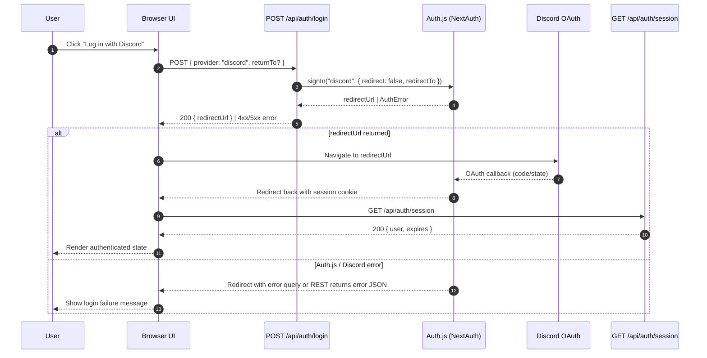

# API Contracts and Token Values

- API endpoints return DTOs from `src/shared/types`. This ensures the same contract is reused across clients.
- REST GET endpoints expose optional relation data through the `relations` query parameter. Each entity maintains an allowlist (e.g., release versions permit `creater`, `builtVersions`, `builtVersions.deployedComponents`, `builtVersions.transitions`). Unknown keys or nested relations without their parent must raise `RestError(400, "INVALID_RELATION")`.
- List endpoints return `PaginatedResponse<T>` (see `src/shared/types/pagination.ts`) so every response includes `data` alongside `pagination { page, pageSize, totalItems, hasNextPage }`. Use `createPaginatedRequestSchema` to normalize inputs and `buildPaginatedResponse` to hydrate responses.
- For build and component versioning, we store a `tokenValues` JSON object alongside records. Shape is defined by `TokenValues`:

```ts
type TokenValues = {
  release_version: string;
  built_version?: string;
  increment: number;
};
```

- Services compute names from patterns and persist the token snapshot using `Prisma.InputJsonValue` at the database boundary.
- When transitioning built statuses, a successor built may be created with an incremented version and token snapshot. Component versions for the successor are created or moved later based on user selection.
- Built version transitions are exposed through explicit per-action mutations (`builtVersion.startDeployment`, `builtVersion.cancelDeployment`, `builtVersion.markActive`, `builtVersion.revertToDeployment`, `builtVersion.deprecate`, `builtVersion.reactivate`) to mirror the one-action-per-endpoint REST design.

## Action History Logging

- Mutations triggered by authenticated users (release creation, built creation, status transitions, successor arrangement, release component creation) emit audit entries stored in `ActionLog` and `ActionSubactionLog` tables.
- Each action captures: UUIDv7 id, `actionType`, human-readable `message`, execution `status` (`success | failed | cancelled`), triggering `userId`, and the current session token to scope the feed.
- Subactions provide a single-depth trace for service-level steps (e.g., auto-created successor, seeded component versions) and inherit the parent action id.
- The REST endpoint `GET /api/v1/action-history` returns the chronological session feed as a `PaginatedResponse<ActionHistoryEntryDto>` for rendering the terminal-style history UI. Responses default to five parent actions per page to keep the scrollback responsive, regardless of how many subactions each action carries.
- Entries persist even when domain operations throw; failure metadata (error message, action context) is stored on the parent action to aid troubleshooting.

## Authentication Endpoints

- `POST /api/auth/login`
  - Body: `{ provider: "discord"; returnTo?: string }` (`returnTo` must be an app-relative path).
  - Success: `200 { redirectUrl: string }`; the client should redirect the browser to `redirectUrl` to start the Discord OAuth flow.
  - Failure: `400 { error: "PROVIDER_UNAVAILABLE" | "INVALID_REQUEST"; message: string }` for schema issues, `500 { error: string; message: string }` for unexpected Auth.js failures.
- `POST /api/auth/logout`
  - Success: `204` after the Auth.js session cookies are cleared server-side.
  - Failure: `500 { error: string; message: string }` when the underlying Auth.js logic raises an error.
- `GET /api/auth/session`
  - Success (authenticated): `200 { user: { id: string; name?: string; email?: string; image?: string }; expires: string }`.
  - Success (guest): `200 { user: null }`.
- All three handlers rely on the existing NextAuth (Auth.js) configuration and therefore do not introduce new providers—the only supported provider remains Discord SSO. Additional providers must extend these handlers explicitly in future work.


