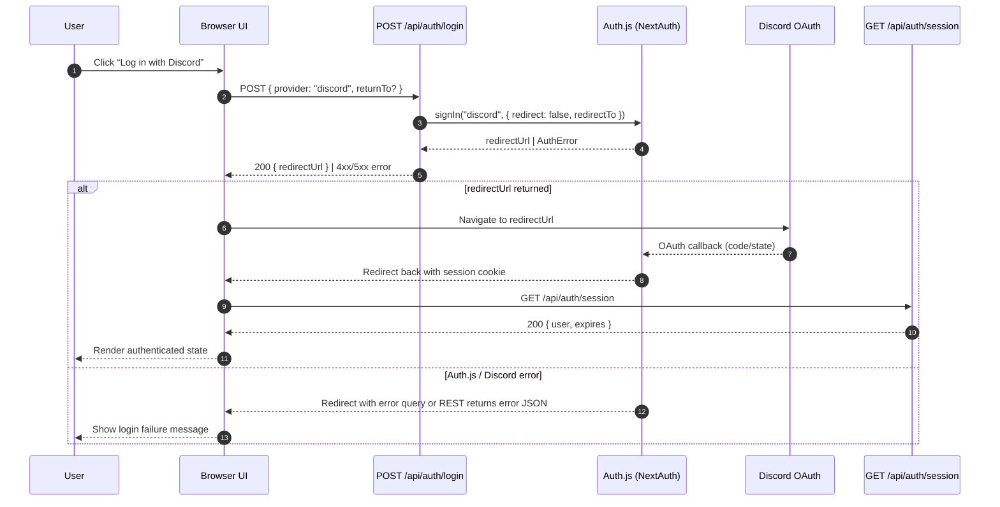

# API Contracts and Token Values

- API endpoints return DTOs from `src/shared/types`. This ensures the same contract is reused across clients.
- REST GET endpoints expose optional relation data through the `relations` query parameter. Each entity maintains an allowlist (e.g., release versions permit `creater`, `patches`, `patches.deployedComponents`, `patches.transitions`). Unknown keys or nested relations without their parent must raise `RestError(400, "INVALID_RELATION")`.
- List endpoints return `PaginatedResponse<T>` (see `src/shared/types/pagination.ts`) so every response includes `data` alongside `pagination { page, pageSize, totalItems, hasNextPage }`. Use `createPaginatedRequestSchema` to normalize inputs and `buildPaginatedResponse` to hydrate responses.
- `ReleaseVersionDto` exposes a `releaseTrack` field derived from the enum `ReleaseTrack = "Future" | "Beta" | "Rollout" | "Active" | "Archived"`. New releases default to `"Future"`; defaults for both name and track are exposed via `GET /api/v1/release-versions/new-values` (authenticated). `POST /api/v1/release-versions` accepts optional `releaseTrack` to override the default at creation.
- Release updates consolidate into `PATCH /api/v1/release-versions/{releaseId}` with payload `{ name?, releaseTrack? }` (at least one field). Track-only updates remain available at `/release-versions/{releaseId}/track` for backward compatibility. Name changes do **not** retroactively rename existing patches (their names remain immutable historical artifacts).
- For build and component versioning, we store a `tokenValues` JSON object alongside records. Shape is defined by `TokenValues`:

```ts
type TokenValues = {
  release_version: string;
  patch?: string;
  increment: number;
};
```

- `ReleaseComponentDto` exposes a required `releaseScope` field. REST create payloads must include `releaseScope: "version-bound" | "global"`, and responses translate the Prisma enum (`version_bound`/`global`) into the hyphenated API values. Clients should use this field to decide which components auto-seed on successor patches versus require per-release selection; the initial release creation seeds all components so both scopes begin with increment `0`.
- Newly created release components do not backfill historical component versions. The API surface (services, successor logic, default selection) respects the provided scope and applies it only to future planning cycles.

- Services compute names from patterns and persist the token snapshot using `Prisma.InputJsonValue` at the database boundary.
- When transitioning patch statuses, a successor patch may be created with an incremented version and token snapshot. Component versions for the successor are created or moved later based on user selection.
- Patch transitions are exposed through explicit per-action mutations (`patch.startDeployment`, `patch.cancelDeployment`, `patch.markActive`, `patch.revertToDeployment`, `patch.deprecate`, `patch.reactivate`) to mirror the one-action-per-endpoint REST design.
- UI color semantics: the release accordion shows a leading color bar that doubles as the track selector (Future→purple, Beta→blue, Rollout→yellow, Active→green, Archived→gray). Clicking the bar opens the track dropdown; choosing a new value updates the backend, invalidates cached release queries, and immediately recolors the bar so the change is visually obvious.

## Action History Logging

- Mutations triggered by authenticated users (release creation, patch creation, status transitions, successor arrangement, release component creation) emit audit entries stored in `ActionLog` and `ActionSubactionLog` tables.
- Each action captures: UUIDv7 id, `actionType`, human-readable `message`, execution `status` (`success | failed | cancelled`), triggering `userId`, and the current session token to scope the feed.
- Subactions provide a single-depth trace for service-level steps (e.g., auto-created successor, seeded component versions) and inherit the parent action id.
- The REST endpoint `GET /api/v1/action-history` returns the chronological session feed as a `PaginatedResponse<ActionHistoryEntryDto>` for rendering the terminal-style history UI. Responses default to five parent actions per page to keep the scrollback responsive, regardless of how many subactions each action carries.
- Entries persist even when domain operations throw; failure metadata (error message, action context) is stored on the parent action to aid troubleshooting.

## Authentication Endpoints

- `POST /api/auth/login`
  - Body: `{ provider: "discord"; returnTo?: string }` (`returnTo` must be an app-relative path).
  - Success: `200 { redirectUrl: string }`; the client should redirect the browser to `redirectUrl` to start the Discord OAuth flow.
  - Failure: `400 { error: "PROVIDER_UNAVAILABLE" | "INVALID_REQUEST"; message: string }` for schema issues, `500 { error: string; message: string }` for unexpected Auth.js failures.
- `POST /api/auth/logout`
  - Success: `204` after the Auth.js session cookies are cleared server-side.
  - Failure: `500 { error: string; message: string }` when the underlying Auth.js logic raises an error.
- `GET /api/auth/session`
  - Success (authenticated): `200 { user: { id: string; name?: string; email?: string; image?: string }; expires: string }`.
  - Success (guest): `200 { user: null }`.
- All three handlers rely on the existing NextAuth (Auth.js) configuration and therefore do not introduce new providers—the only supported provider remains Discord SSO. Additional providers must extend these handlers explicitly in future work.



## Seed Ownership Transfer

- Local fixtures are inserted with a synthetic `SEED_PLACEHOLDER_USER` so every `createdById` can be satisfied before OAuth runs.
- The NextAuth `signIn` event invokes `claimSeedOwnership()` which, inside a single transaction, moves `createdById` references (release components, releases, patches, patch transitions, action logs) from the placeholder to the first authenticated user and removes the placeholder row.
- Operators can re-run the process manually with `pnpm run seed:claim-owner <user-id|email>` when recovering from partially completed migrations.
