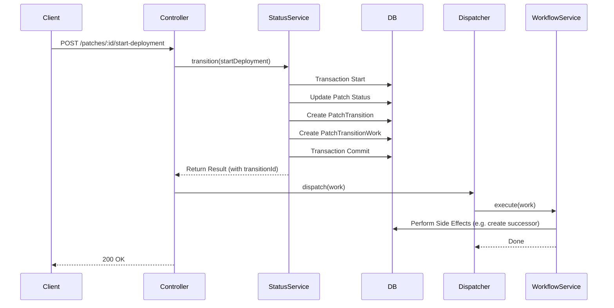

# Patch Transition Workflows

## Overview

The **Patch Transition Workflow** architecture decouples the core state machine of a Patch from the side effects (business logic) that should occur when a transition happens.

This separation ensures:
1.  **Reliability**: State changes (`PatchTransition`) are recorded atomically. Side effects are tracked separately as `PatchActionWorkItem`.
2.  **Extensibility**: Adding new side effects (e.g., Slack notifications, Jira sync) doesn't clutter the core `PatchStatusService`.
3.  **Observability**: Each workflow step is logged via `ActionLogger`.

## Core Concepts

### 1. PatchTransition vs. PatchActionWorkItem

| Concept | Description |
| :--- | :--- |
| **PatchTransition** | **"What happened"**. An immutable record that a Patch moved from Status A to Status B via Action X. This is the source of truth for the patch's history. |
| **PatchTransitionWork** | **"What needs to be done"**. A task created immediately after a transition. It contains the context needed to execute side effects (e.g., creating a successor patch). |

### 2. Architecture

1.  **Trigger**: A user triggers an action (e.g., `startDeployment`) via the API.
2.  **State Change**: `PatchStatusService` validates the transition, updates the `Patch` status, and records a `PatchTransition`.
3.  **Work Item Creation**: Within the same transaction, a `PatchTransitionWork` is created.
4.  **Dispatch**: The `PatchTransitionsController` initializes the `ActionWorkflowDispatcher` and dispatches the work item.
5.  **Execution**: The dispatcher routes the item to the specific `ActionWorkflowService` for that action.

## Implementation Guide

### How to Implement a New Workflow

To add side effects for a specific action (e.g., `markActive`):

1.  **Create the Service**:
    Create a new file in `src/server/workflows/services/` (e.g., `mark-active.workflow.ts`) implementing `ActionWorkflowService`.

    ```typescript
    import type { ActionWorkflowInput, ActionWorkflowService } from "../types";

    export class MarkActiveWorkflowService implements ActionWorkflowService {
      constructor(private readonly db: PrismaClient) {}

      async execute({ patchId, userId, logger }: ActionWorkflowInput) {
        // 1. Log the step
        await logger.subaction({
            subactionType: "patch.workflow.markActive.notify",
            message: "Notifying team of active patch",
            metadata: { patchId },
        });

        // 2. Perform business logic
        // ...
      }
    }
    ```

2.  **Register in Dispatcher**:
    Update `src/server/rest/controllers/patch-transitions.controller.ts` to use your new service instead of `NoOpWorkflowService`.

    ```typescript
    const dispatcher = new ActionWorkflowDispatcher({
      // ...
      markActive: new MarkActiveWorkflowService(context.db),
      // ...
    });
    ```

## Workflow Visualization

The following sequence diagram illustrates the flow from API trigger to workflow execution.



## Future Integrations

The workflow architecture is designed to support external integrations as side effects.

### Planned Integrations

-   **GitLab**: Triggering CI/CD pipelines when a patch is marked as `active` or `in_deployment`.
-   **Jira**: Updating Jira ticket status (e.g., "Ready for QA") when a patch transition occurs.

These integrations will be implemented as new `ActionWorkflowService` classes (e.g., `GitlabPipelineWorkflow`, `JiraSyncWorkflow`) and registered in the dispatcher.

### Best Practices

-   **Idempotency**: Workflow actions should ideally be idempotent, as they might be retried in the future (though currently executed synchronously).
-   **Logging**: Use the provided `logger` to record every significant step. This appears in the Action History UI.
-   **No State Changes in Workflow**: Avoid changing the *Patch Status* within a workflow. If a workflow fails, the Patch remains in the new status, but the `PatchActionWorkItem` is marked as failed (future improvement).
