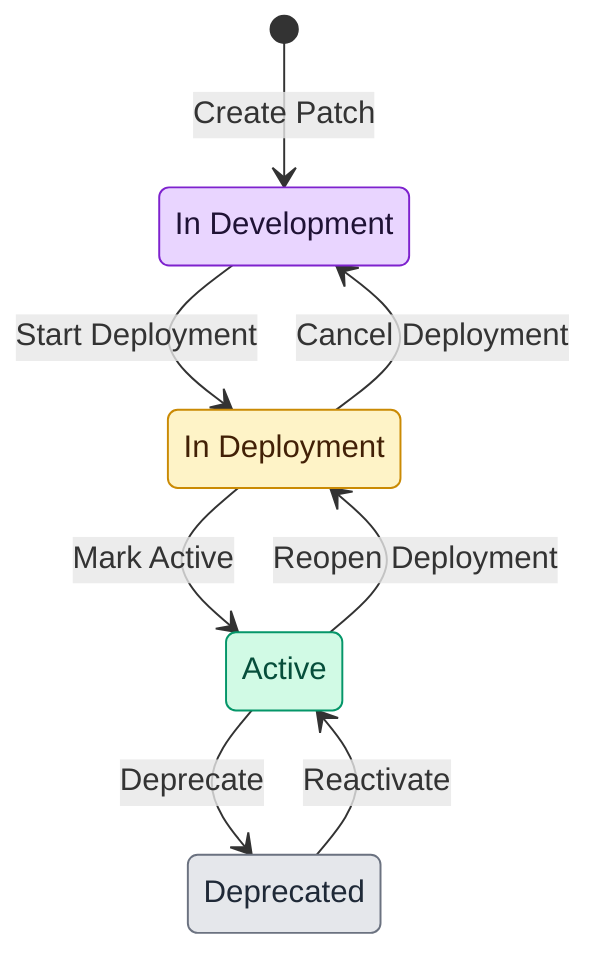

# Patch Lifecycle

The Patch lifecycle is driven entirely by status transitions recorded in `PatchTransition`. Every transition carries both a human-friendly name (used in the UI) and a canonical action ID (used in REST/Prisma). The diagram below is the single source of truth for allowed paths.

## Transition Table

| Transition Name     | Action ID           | From State       | To State         | Notes |
|---------------------|---------------------|------------------|------------------|-------|
| Create Patch        | *(automatic)*       | `[*]`            | `in_development` | Happens when a release auto-seeds its first patch or a successor is created. |
| Start Deployment    | `startDeployment`   | `in_development` | `in_deployment`  | Locks the patch for deployment planning and seeds the successor. |
| Cancel Deployment   | `cancelDeployment`  | `in_deployment`  | `in_development` | Reopens the patch for changes; successor remains untouched. |
| Mark Active         | `markActive`        | `in_deployment`  | `active`         | Signals that the patch is live; default selections mirror this patch. |
| Reopen Deployment   | `revertToDeployment`| `active`         | `in_deployment`  | Moves the patch back into deployment if issues are found post-activation. |
| Deprecate           | `deprecate`         | `active`         | `deprecated`     | Marks the patch as sunset; successor selections ignore it. |
| Reactivate          | `reactivate`        | `deprecated`     | `active`         | Reverses a deprecation when a patch must be re-promoted. |

### Usage Guidelines

- REST endpoints under `/release-versions/{releaseId}/patches/{patchId}/{action}` call the corresponding action IDs listed above.
- `PatchStatusService` enforces the from/to states and records `PatchTransition`; side effects (e.g., successor creation on *Start Deployment*) are handled by transition workflows.
- The UI (e.g., `PatchCard`) surfaces the transition names shown in the table so operators see consistent wording.
- Transition validation is centralized in `ValidatePatchTransitionService`, which holds the `{ fromStatus, toStatus }` map keyed by the Prisma `PatchTransitionAction` enum. A transition is persisted to `PatchTransition` only after the validator allows it and records the triggering `createdById` (consistent with all other entities).

## Preflight & Workflow Visibility

- Each transition endpoint exposes a GET preflight on the same path to surface `allowed`, `blockers`, `expectedSideEffects`, and action-specific context before POSTing.
- Transition POST calls log workflow substeps to `ActionHistory` using `patch.workflow.<action>` entries so operators can see the expected follow-up work per action.

Refer back to this document whenever a new status or transition is proposed; any addition must be reflected in both the table and the state diagram.
