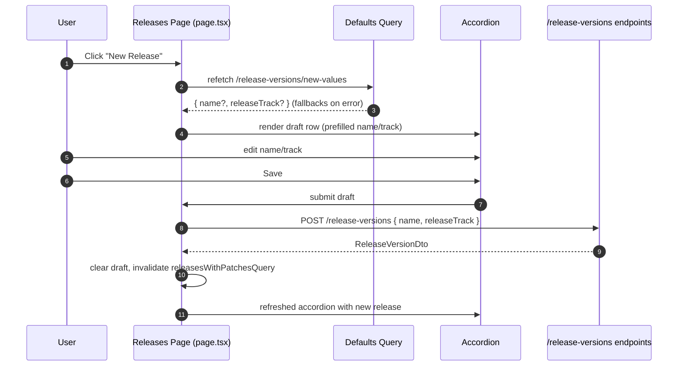

# Create Release Version (UI data flow)

## Flow

- User clicks `New Release` on the Releases page (`src/app/versions/releases/page.tsx`).
- Page starts a draft and refetches `GET /api/v1/release-versions/new-values` via `useReleaseDefaultsQuery`; name and track state are prefilled from the response (fallbacks: empty name, `Future` track).
- A draft row appears at the top of the accordion with the same inline name-edit UI used for renaming existing releases plus the standard track selector chip.
- User edits the name or track; local state is kept in page-level draft state and passed into `ReleasesAccordion`.
- On `Save`, the page calls `useCreateReleaseMutation` (POST `/api/v1/release-versions`) with `{ name, releaseTrack }`. On success it clears the draft and invalidates `releasesWithPatchesQueryKey` to refresh the accordion contents.
- On `Cancel`, the draft row is removed and no network request is made. Default-fetch errors only show a small inline hint; form remains usable with current fallbacks.

## Components & hooks

- Page container: `src/app/versions/releases/page.tsx` (owns draft state, default fetch, and create mutation wiring).
- Accordion: `src/app/versions/releases/components/releases-accordion.tsx` renders existing releases and the draft row when present.
  - Draft row uses the same input + save/cancel affordance as `ReleaseNameEditor` and the shared track selector styling.
- API hooks: `useReleaseDefaultsQuery`, `useCreateReleaseMutation` from `src/app/versions/releases/api.ts`.
- UI primitives: `Button`, `Input`, `Popover`/`PopoverContent`/`PopoverTrigger`, `Check`/`ChevronDown` icons from `lucide-react`.

## Endpoint contracts

- Defaults: `GET /api/v1/release-versions/new-values` → `{ name: string; releaseTrack: ReleaseTrack }` (derived from latest release; track defaults to `Future`).
- Create: `POST /api/v1/release-versions` → `ReleaseVersionDto` (accepts `name`, optional `releaseTrack`; uses defaults service when missing).
