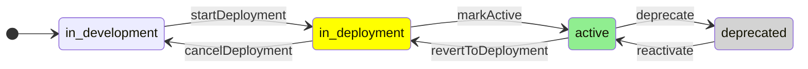

# Patch: Behavior & Side Effects

This document explains how Releases (Patches) are created, named, and how their lifecycle and UI updates are derived.

## Automatic Creation & Naming

- On Release creation: An initial Patch is automatically created with name pattern `{release_version}.{increment}` using increment `0` (e.g., `version 178.0`). Component versions are seeded for every release component, each starting at increment `0`.
- On transition to deployment: When a Patch transitions from `in_development` to `in_deployment`, a successor Patch is automatically created for the same Release with the next increment (e.g., `version 178.1`).
- Successor guard: A successor is only created if no newer Patch already exists for that Release. If a newer patch exists, no additional patch (e.g., `.3`) is created.
- Release-scoped increment: The increment for Patch names is tracked on `ReleaseVersion.lastUsedIncrement` and increases per Release (starts at `-1`, first auto patch is `0`).

## Token Snapshots

To make name generation reproducible and auditable:

- `Patch.tokenValues` stores `{ "release_version": string, "increment": number }`.
- `ComponentVersion.tokenValues` stores `{ "release_version": string, "patch": string, "increment": number }`.

## Release Component Scope

- Each Release Component must define a `releaseScope`: `version-bound` or `global`.
- **Global** components represent platform-wide dependencies. They are auto-seeded into every new patch (including the initial patch for a new release) and remain selected by default during successor arrangement, even when omitted in the UI.
- **Version-bound** components are release-specific. They are included in the initial Patch for tracking (increment `0`), but they are never auto-seeded for successor patches; operators choose them explicitly per deployment cycle.
- Newly created components do not backfill historical Patches. Their scope rules start applying with the next deployment planning session.

## Successor Creation (createSuccessorPatch)

When a Patch transitions to `in_deployment`, operators select which components to include in that release.

Behavior:

- Successor creation: The successor Patch (X+1) is auto-created on the status transition `startDeployment` (in_development → in_deployment) if no newer patch exists yet.
- Selected components: remain attached to the releasing Patch (X). Ensure exactly one successor row exists in (X+1) per component via an upsert using the naming helpers and token snapshots. Successor component series start at increment `0`.
- Unselected components: move the existing row from X to X+1 (no new entity). Recompute name and token snapshot using the successor’s name. If a non-materialized placeholder exists in X+1 for that component, remove it before the move to avoid duplicates; otherwise perform the move idempotently.
- Validation: at least one component must be selected; otherwise return a validation error.
- Transactional and idempotent: perform the entire operation in a single transaction; enforce uniqueness on `(patchId, releaseComponentId)` in the successor to prevent duplicates.
  Notes:
- The selection step (`createSuccessorPatch`) keeps the patch in `in_deployment`. Marking a patch `active` is a separate transition performed afterwards.
- Naming uses `{release_version}`, `{patch}`, `{increment}` with snapshots stored on both Patch and Component rows.
- Allowed only when the current status is `in_deployment`.
- Retries of `createSuccessorPatch` must be idempotent (no duplicate successor rows, no name regressions) and should handle existing placeholders gracefully.
- Terminology: a “placeholder” ComponentVersion is a pre-created, non-materialized row that can be safely replaced/removed during selection.

## Lifecycle & Status Derivation

- `Patch.currentStatus` stores the denormalized lifecycle state for fast reads. `PatchStatusService` writes to this column inside the same transaction that persists a `PatchTransition`, so reads never aggregate history.
- `PatchTransition` remains the append-only audit log and source for history/analytics.
  - No transition history ⇒ `currentStatus` falls back to `in_development`.
  - `PatchStatusService` still validates every requested change against the transition rules.
- Reversible actions: `cancelDeployment`, `revertToDeployment`, `reactivate`.

### Allowed Transitions

## UI Behavior

- Releases page (`src/app/versions/releases/page.tsx`) invalidates and refetches the releases-with-patches list only after a successful `startDeployment` transition, ensuring the auto-created successor appears immediately. Other transitions do not trigger a list reload.
- The page caches the releases-with-patches response in `localStorage` under `jrm:releases:accordion:releases-with-patches:v1` as placeholder data and refreshes on demand.
- Default selection (no prior active patch): selects every global `ReleaseComponent`. When an active patch exists, defaults mirror its component selection and automatically re-include the global set.
- The calendar mode on the releases page reuses this cached payload as-is; refer to `docs/business_logic/release_calendar.md` for the event contract and UI behavior.

## Key Files

- Prisma models: `prisma/schema.prisma` (`ReleaseVersion.lastUsedIncrement`, `Patch.tokenValues`, `ComponentVersion.tokenValues`, `PatchTransition` + enums)
- Services: `src/server/services/release-version.service.ts`, `src/server/services/patch-status.service.ts`, `src/server/services/deployment.service.ts`
- REST exposure for `createSuccessorPatch` has been removed; the service remains available for internal orchestration if needed.
