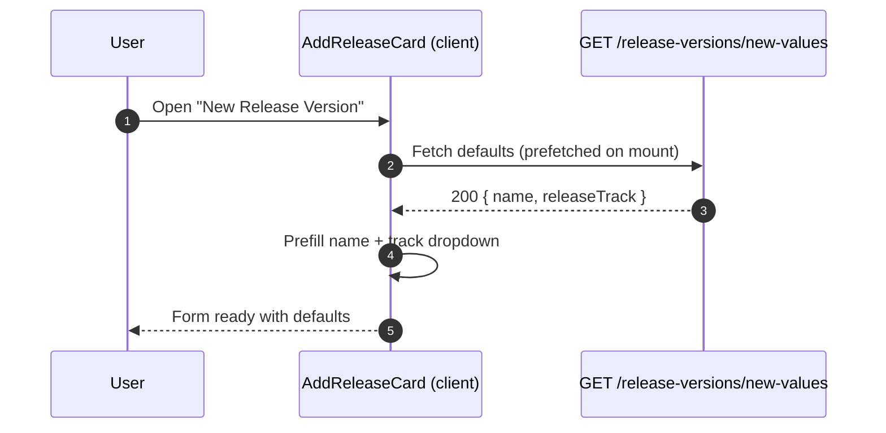
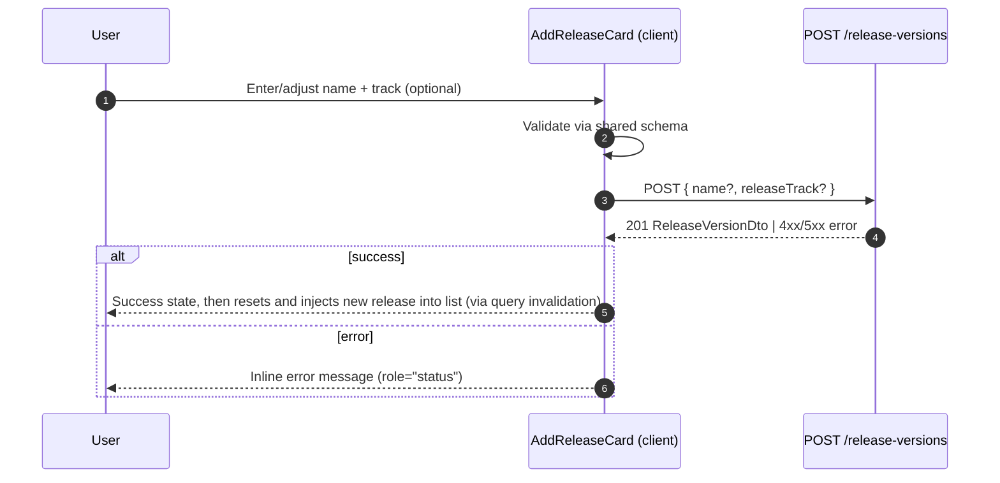

# Add Release Card (existing view)

Purpose: let authenticated users create a release version inline on the releases page with sensible defaults. The card fetches defaults, lets the user adjust, and submits the create mutation without leaving the page.

- Location: `src/app/versions/releases/components/add-release-card.tsx` (client component rendered on `/versions/releases`).
- UI primitives: `Card`, `CardContent`, `Button`, `Input`, `Label`, `GlowingEffect`, `Popover` from `src/components/ui/*`; existing auth helpers `useAuthSession`, `useDiscordLogin` gate access. Track selection uses the same swatch dropdown (`Popover` + buttons) pattern as the release accordion track selector.
- Data hooks: `useCreateReleaseMutation` (wraps `POST /api/v1/release-versions`) and, after refinement, a lightweight query for `GET /api/v1/release-versions/new-values` to prefill name and track. Defaults are now preloaded on mount so the form opens with values ready.
- Access: when unauthenticated, the card prompts Discord login and disables submission; when authenticated, it reveals the form.

## Default prefill flow

## Submit flow

